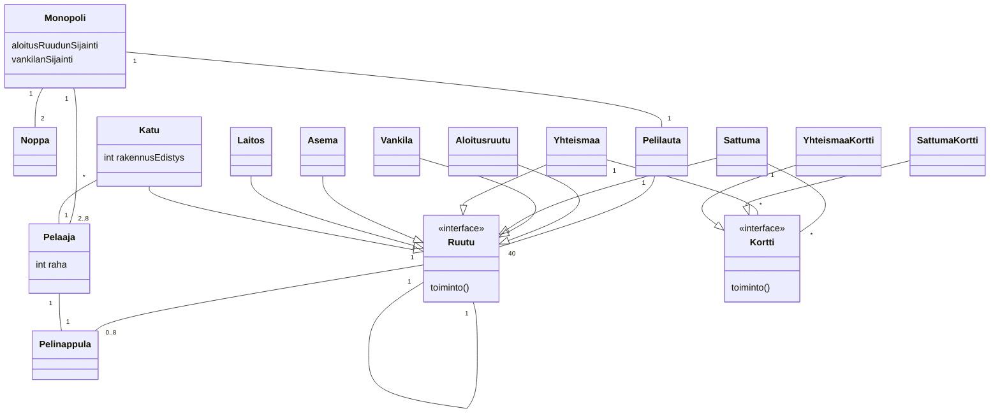

```mermaid
classDiagram
    Monopoli "1" -- "2" Noppa
    Monopoli "1" -- "2..8" Pelaaja
    Monopoli "1" -- "1" Pelilauta
    
    Pelilauta "1" -- "40" Ruutu

    Ruutu "1" -- "1" Ruutu
    Ruutu "1" -- "0..8" Pelinappula

    Pelaaja "1" -- "1" Pelinappula

    Aloitusruutu --|> Ruutu
    Vankila --|> Ruutu
    Sattuma --|> Ruutu
    Yhteismaa --|> Ruutu
    Asema --|> Ruutu
    Laitos --|> Ruutu
    Katu --|> Ruutu

    Sattuma "1" -- "*" Kortti
    Yhteismaa "1" -- "*" Kortti

    SattumaKortti --|> Kortti
    YhteismaaKortti --|> Kortti

    Katu "*" -- "1" Pelaaja

    class Monopoli
        Monopoli : aloitusRuudunSijainti
        Monopoli : vankilanSijainti

    class Pelaaja
        Pelaaja : int raha

    class Ruutu
        <<interface>> Ruutu
        Ruutu : toiminto()

    class Katu
        Katu : int rakennusEdistys

    class Kortti
        <<interface>> Kortti
        Kortti : toiminto()
```
